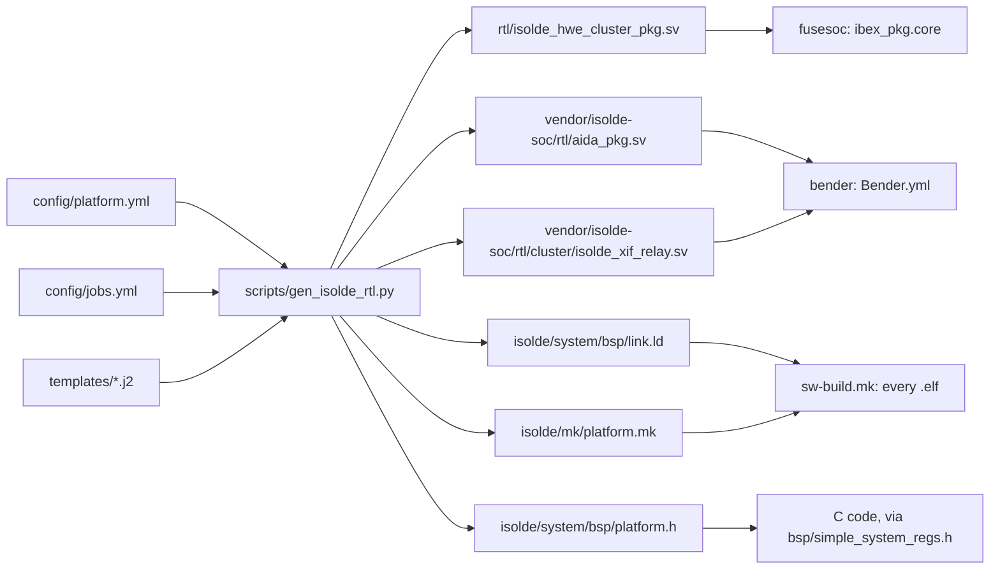

# Configuring the ISOLDE system

The ISOLDE cluster is configured from one place, [`isolde/config`](../config).
Two YAML files there describe the hardware platforms and select which one
is built:

| File | Role |
|---|---|
| [`platform.yml`](../config/platform.yml) | The platforms: number of RedMulE tiles, memory map, scratchpad window, boot offset |
| [`jobs.yml`](../config/jobs.yml) | The platform to build, and the files to generate for it |

The platform settings reach RTL, the linker, C code and the build system
through generated files. Nobody edits those files by hand: they are rendered
from [`isolde/templates`](../templates) by
[`gen_isolde_rtl.py`](../scripts/gen_isolde_rtl.py) and committed.



## Quick reference

In `isolde/system`:

```bash
make generate           # render every file listed in config/jobs.yml
make check-generated    # fail if a committed file no longer matches the config
make generate-env       # print the paths the generator uses
```

To switch the whole system to another platform, change the one `platform:`
line at the top of `jobs.yml`, then regenerate and rebuild both hardware and
software. See [Selecting a platform](#selecting-a-platform).

## The platforms

`platform.yml` currently defines four. `jobs.yml` selects `demo_3`.

| Platform | Tiles | instrram | dataram | stack | Description |
|---|---:|---:|---:|---:|---|
| `aida` | 2 | 16 KiB | 16 KiB | 2 KiB | development, 2 tiles |
| `demo` | 2 | 32 KiB | 32 KiB | 16 KiB | joined demo, 2 tiles |
| **`demo_3`** | **3** | **32 KiB** | **32 KiB** | **16 KiB** | joined demo, 3 tiles (selected) |
| `demo_3_60KiB` | 3 | 60 KiB | 60 KiB | 16 KiB | 60 KiB, 3 tiles |

All four use the same origins (`instrram` 0x0010_0000, `dataram` 0x0011_0000,
`stack` 0x0014_0000), the same boot offset and the same scratchpad window.

## `jobs.yml` reference

```yaml
platform: demo_3

jobs:
  - template: isolde_hwe_cluster_pkg.sv.j2
    output: rtl/isolde_hwe_cluster_pkg.sv
  # ...
```

| Key | Meaning |
|---|---|
| `platform` | The platform from `platform.yml` that **every** job is rendered for |
| `jobs[].template` | A file in `isolde/templates` |
| `jobs[].output` | Where the result goes, relative to the repository root |
| `jobs[].n_tiles` | Optional tile-count override for one job. Avoid it: it lets the RTL packages and the relay disagree |

A `platform:` key inside a job is rejected. Mixing platforms would build RTL
for one memory map and firmware for another. The generator's `--platform`
option overrides the top-level value, for a one-off render or check.

## `platform.yml` reference

```yaml
schema_version: 1

defaults: &defaults
  boot_offset: 0x80
  spm:
    narrow_addr_base: 0x80001000
    narrow_size: 0x8000        # 32 kB per tile

platforms:
  demo_3:
    <<: *defaults
    description: "joined demo,32 KiB, 3 tiles"
    n_tiles: 3
    memory:
      instrram: { origin: 0x00100000, length: 0x8000 }
      dataram:  { origin: 0x00110000, length: 0x8000 }
      stack:    { origin: 0x00140000, length: 0x4000 }
```

Numbers may be written in any base YAML accepts (`0x8000`, `32768`).
`defaults` is a YAML anchor: each platform pulls it in with `<<: *defaults`
and adds its own keys. **`platform.yml` is the only source of values**: the
generator has no built-in defaults, so every key below except `description`
must be present, directly or through `defaults`.

| Key | Meaning | Lands in |
|---|---|---|
| `schema_version` | Format version; must be 1 | checked only |
| `n_tiles` | Number of RedMulE tiles (`isolde_tile` instances), ≥ 1 | `N_HWE_TILES`, the relay's `N_TILES`, `N_TILES` in `platform.mk`, `PLATFORM_N_TILES` |
| `memory.instrram` | Instruction RAM: `origin`, `length` in bytes | `IMEM_ADDR`/`IMEM_SIZE_I32`, `MEMORY instrram`, `PLATFORM_INSTRRAM_*` |
| `memory.dataram` | Data RAM: `.rodata`, `.data`, `.bss` | `DMEM_ADDR`/`DMEM_SIZE_I32`, `MEMORY dataram`, `__dmem_start`/`__dmem_end`, `PLATFORM_DATARAM_*` |
| `memory.stack` | Stack RAM, a separate memory | `SMEM_ADDR`/`SMEM_SIZE_I32`, `MEMORY stack`, `_stack_start`, `PLATFORM_STACK_*` |
| `boot_offset` | Reset vector offset inside `instrram` | `RV_BOOT_ADDR`, `_entry_point` in `link.ld`, `PLATFORM_BOOT_ADDR`. **Also change by hand:** see [below](#changing-boot_offset-or-the-instrram-origin) |
| `spm.narrow_addr_base` | Base of the scratchpad window seen by the core | `SPM_NARROW_ADDR_BASE`, `PLATFORM_SPM_NARROW_ADDR` |
| `spm.narrow_size` | Scratchpad window per tile, bytes | `SPM_NARROW_SIZE`, `PLATFORM_SPM_NARROW_SIZE` |
| `description` | Free text, optional | nowhere |

**The generator refuses the configuration**, naming the file, platform and
key, when any of these fail:

- **Keys:** a key is unknown (a typo such as `boot_ofset` or `n_tile`), a
  required key is missing, or `schema_version` is not 1.
- **Region names:** a region is missing. `instrram`, `dataram` and `stack`
  are required, and the names are fixed: `link.ld`'s `SECTIONS` and
  `aida_pkg`'s `IMEM`/`DMEM`/`SMEM` bind to them. Further regions are
  allowed and reach `link.ld`, `platform.mk` and `platform.h`.
- **Region lengths:** a length is zero or not a multiple of 4. `aida_pkg.sv`
  sizes the SRAMs in 32-bit words (`*_SIZE_I32`).
- **Overlaps:** two regions overlap, or the scratchpad window
  `[narrow_addr_base, narrow_addr_base + n_tiles × narrow_size)` overlaps a
  region.
- **Boot offset:** `boot_offset` lies outside `instrram`.

**Two things to keep in mind:**

- **`<<: *defaults` is a shallow merge.** A platform that writes its own
  `spm:` replaces the whole mapping from `defaults`, so it must give both
  `narrow_addr_base` and `narrow_size`. The generator stops if one is
  missing.
- **`narrow_size` must match the hardware.** 0x8000 is 512 rows of 64 bytes,
  which matches the default depth of the 512-word SPM banks in
  `isolde_tile.sv`. Change both together. The fixed peripheral addresses
  below are not checked against the configuration either.

## The memory map

For `demo_3`. Rows marked *platform.yml* come from the configuration. The
others are fixed in [`templates/aida_pkg.sv.j2`](../templates/aida_pkg.sv.j2)
and, on the software side, in `isolde/system/bsp/simple_system_regs.h`.

| Range | Size | What | Source |
|---|---:|---|---|
| 0x0000_0080 – 0x0000_0095 | 22 B | boot ROM (`TARGET_RV_DEBUG` builds) | fixed |
| 0x0010_0000 – 0x0010_7FFF | 32 KiB | `instrram`; reset vector at +`boot_offset` (0x80) | *platform.yml* |
| 0x0011_0000 – 0x0011_7FFF | 32 KiB | `dataram` | *platform.yml* |
| 0x0014_0000 – 0x0014_3FFF | 16 KiB | `stack`; stack grows down from 0x0014_4000 | *platform.yml* |
| 0x1A11_0000 – 0x1A11_0FFF | 4 KiB | RISC-V debug module | fixed |
| 0x8000_0000 – 0x8000_000B | 12 B | MMIO: simulation exit, print (UART), perf TTY | fixed |
| 0x8000_000C – 0x8000_0028 | 29 B | performance counters | fixed |
| 0x8000_0100 – 0x8000_011F | 32 B | SPM loader descriptor registers | fixed |
| 0x8000_1000 – 0x8001_8FFF | 3 × 32 KiB | scratchpad window, `n_tiles × narrow_size` | *platform.yml* |

The core reaches a tile's scratchpad through the window, and the `TILESEL`
CSR picks which tile. Software addresses a tile's SPM from
`narrow_addr_base`, one tile at a time.

## Generated files

| Output | Template | Consumed by | Carries |
|---|---|---|---|
| `rtl/isolde_hwe_cluster_pkg.sv` | `isolde_hwe_cluster_pkg.sv.j2` | fusesoc (`ibex_pkg.core`) | `N_HWE_TILES`, `SPM_NARROW_ADDR_BASE`, `SPM_NARROW_SIZE`, CSR widths |
| `vendor/isolde-soc/rtl/aida_pkg.sv` | `aida_pkg.sv.j2` | bender (`Bender.yml`) | memory sizes and origins, `RV_BOOT_ADDR`, fixed peripheral map |
| `vendor/isolde-soc/rtl/cluster/isolde_xif_relay.sv` | `isolde_xif_relay.sv.j2` | bender | CV-X-IF relay with one case arm per tile. It is generated because Verilator cannot index an interface array with a run-time signal. |
| `isolde/system/bsp/link.ld` | `link.ld.j2` | every firmware `.elf` (`sw-build.mk`) | `MEMORY`, entry point, stack and `__dmem_*` symbols |
| `isolde/mk/platform.mk` | `platform.mk.j2` | `sw-build.mk`, `fragment_hex.sh` | `N_TILES`, `*_ORIGIN`/`*_LENGTH`/`*_LAST`, the ihex split ranges |
| `isolde/system/bsp/platform.h` | `platform.h.j2` | C code; `bsp/simple_system_regs.h` includes it | `PLATFORM_N_TILES`, `PLATFORM_<REGION>_ORIGIN`/`_LENGTH`, `PLATFORM_BOOT_ADDR`, `PLATFORM_SPM_NARROW_ADDR`/`_SIZE` |

Each generated file starts with `THIS IS A GENERATED FILE - DO NOT EDIT` and
names its platform. Edit the template or the YAML instead.

In C, include `<bsp/platform.h>`, or `<bsp/simple_system_regs.h>`, which
defines `SPM_NARROW_ADDR` and `SPM_NARROW_SIZE` from it. Every value carries
a `u` suffix, so the header is for C, not assembly.

## When generation runs

`isolde/system/Makefile` includes [`mk/generate.mk`](../mk/generate.mk), and
`sw-build.mk` includes the generated `platform.mk`. So whenever
`platform.yml`, `jobs.yml`, a template or the generator is newer than
`isolde/system/.generated.stamp`, **the next `make` in `isolde/system`
regenerates all six files first**, whatever the target. `make generate` does
the same explicitly.

Only the software side is wired as a make dependency (`%.elf: link.ld`). The
Verilator model, the bender file lists and the FPGA bitstream are not rebuilt
automatically. After a platform change, rebuild them yourself (next section).

## Selecting a platform

1. Set `platform:` at the top of `jobs.yml`.
2. Regenerate and check:
   ```bash
   cd isolde/system
   make generate
   git diff --stat        # the generated files that changed
   make check-generated
   ```
3. Rebuild everything that embeds the configuration:
   ```bash
   make -f Makefile.nodbg veri-clean verilate          # simulator
   make TEST=<app> test-clean test-build               # firmware
   ```
   For the FPGA, regenerate the bender file lists and rebuild the bitstream.
4. Commit `jobs.yml` **together with** the regenerated files.
   `make check-generated` is the review-time guard against forgetting.

### Application assumptions to check

Some applications depend on the platform:

- **Tile count:** `radar_attention` and `radar_beamforming` need 3 tiles
  (the ONNX variant of `radar_beamforming` needs 2). They check
  `isolde_get_tile_cnt()` at start-up and print `FAILED insufficient RedMulE
  tiles` otherwise.
- **Data RAM size:** `radar_attention` checks its data budget at build time
  against `TF_DMEM_BYTES`. That now defaults to `PLATFORM_DATARAM_LENGTH`, so
  it follows the selected platform; `make TEST=radar_attention budget` shows
  the headroom.

## Adding a platform

Add an entry under `platforms:` and select it in `jobs.yml`:

```yaml
  demo_4:
    <<: *defaults
    description: "4 tiles, 32 KiB"
    n_tiles: 4
    memory:
      instrram: { origin: 0x00100000, length: 0x8000 }
      dataram:  { origin: 0x00110000, length: 0x8000 }
      stack:    { origin: 0x00140000, length: 0x4000 }
```

To look at one file for a platform without touching the committed ones, run
the generator directly. In `isolde/system`, pass `--config` and
`--template-dir` explicitly: the script's own defaults point at the wrong
directory.

```bash
python3 ../scripts/gen_isolde_rtl.py --config ../config/platform.yml \
    --template-dir ../templates --platform demo_4 --template link.ld.j2
```

`--n-tiles N` overrides the platform's tile count for such a one-off render.

## Changing `boot_offset` or the `instrram` origin

The generated files follow the configuration: `RV_BOOT_ADDR`, `link.ld`'s
`_entry_point` and `PLATFORM_BOOT_ADDR`. **These files are not generated and
must be fixed by hand:**

- **`isolde/system/bsp/crt0.S`** places the reset jump with `.org 0x80` in
  `.vectors`.
- **The OpenOCD scripts** start the core with a hard-coded
  `reg pc 0x00100080`, which is `instrram.origin + boot_offset`:
  `jtag_upload.tcl` (`nxp_upload`, `upload`, `soft_reset`),
  `load_and_run.tcl`, `quick_test.tcl` and `imem_test.tcl`. `img_test.tcl`
  and `imem_test.tcl` also read or write that address directly.

