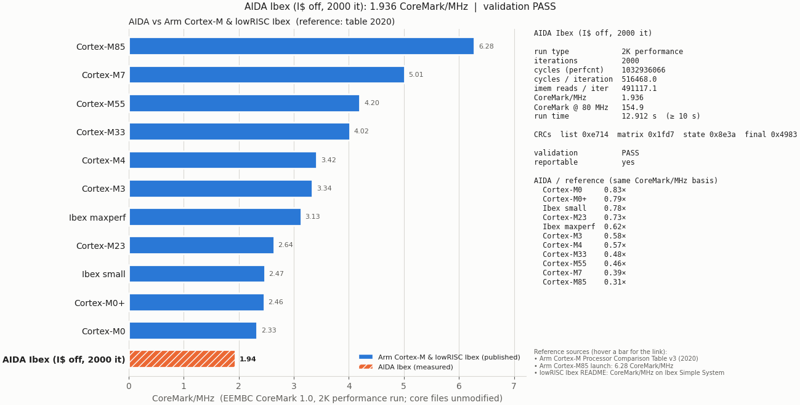

# CoreMark for AIDA (`aida_tb`, ZCU104)

This is EEMBC CoreMark 1.0 ported to the ISOLDE AIDA cluster. It runs on the `aida_tb` Verilator testbench and on the ZCU104.
The port is based on lowRISC's Ibex `simple_system` port (`examples/sw/benchmarks/coremark`), with these differences:

| | lowRISC simple_system port | This port |
| --- | --- | --- |
| `core_main.c` | Has the vendored patch `0001-no-minimum-run-time` (10-second check removed) | **Unmodified upstream** copy (md5 `3c7e2aec…`, same as `coremark.md5`) |
| Other core files | Built from `vendor/eembc_coremark` | Same: `core_list_join.c` etc. here are one-line `#include`s of the vendored files, which are unmodified (md5-checked) |
| Timer | `mcycle`, with `CLOCKS_PER_SEC` set to 500 kHz | **`aida_perfcnt` only** (MMIO, id `0xC0E`), no CSR instructions; seconds use the real clock `COREMARK_CLOCK_HZ` (80 MHz) |
| Result | `float` CoreMark/MHz (soft float) | Fixed-point CoreMark/MHz; no soft-float runtime is needed (`HAS_FLOAT=0`) |
| Pass/fail | `main` always returns 0 | Exit code = number of failures, so `aida_tb` prints `errors=00000000` only for a validated run |

The port executes no CSR instructions of its own: no `mcycle`, `minstret` or `cpuctrlsts`. The only
exception is `COREMARK_ICACHE=1`, which enables the I-cache through the BSP. `start_time()` and
`stop_time()` write the id to `PERFCNT+0x00`, and `get_time()` reads the elapsed cycles from `PERFCNT+0x04`.
The report also prints `aida_perfcnt`'s instruction-memory and data/stack-memory read and write counts for the timed region.

The run is the standard **2K performance run** (`TOTAL_DATA_SIZE=2000`, `PERFORMANCE_RUN`, seeds `0,0,0x66`, data on the stack).
The program checks the list, matrix and state CRCs against the known values.

## Pass, fail and "reportable"

`core_main.c` always returns 0, so `core_portme.c` watches what it prints:

- **Validation PASS**: the run parameters are known and there are no CRC or data-type errors. Exit code 0.
- **Validation FAIL**: a CRC mismatch, a data-type error, or unknown seeds. Exit code = number of failures.
- **Reportable**: EEMBC only accepts a score from a run of **at least 10 s**. The short simulation run passes
  validation but isn't reportable. `core_main.c` then prints its own
  `ERROR! Must execute for at least 10 secs` / `Errors detected`, and the port's summary explains it:

```
COREMARK_RESULT iterations=10 cycles=5164658 instret=3562230 coremark_per_mhz_x1000=1936 clock_hz=80000000 validated=1 reportable=0
Validation: PASS (CRCs match the known run parameters)
Reportable: NO (run time < 10 s; increase ITERATIONS) - core_main's "ERROR! Must execute..." refers to this
```

## Build and run

```sh
cd isolde/system
. ./eth.sh
make -f Makefile.nodbg patch                  # once, after the Bender checkout
make -f Makefile.nodbg veri-clean verilate    # once per RTL configuration

# Verilator: 2 iterations, aprox 2 min of simulation
make TEST=coremark TEST_CFLAGS="-DITERATIONS=2" test-clean test-build

# Board: a reportable run needs >= 10 s, i.e. ITERATIONS >= ~1550 at 80 MHz  
make TEST=coremark TEST_CFLAGS="-DITERATIONS=2000" test-clean test-build
```


| Define (`TEST_CPPFLAGS`) | Default | Meaning |
| --- | --- | --- |
| `ITERATIONS` | 10 | Iterations. 2000 runs for about 13 s on the ZCU104. 32-bit cycle counters limit a run to about 8000 iterations at 80 MHz. |
| `COREMARK_CLOCK_HZ` | 80000000 | Core clock, only used for seconds and the 10-second rule. CoreMark/MHz doesn't depend on it. |
| `COREMARK_ICACHE` | 0 | 1 = enable the Ibex I-cache in `portable_init` |
| `COREMARK_TRAP_HANDLER` | 0 | 1 = point `mtvec` at crt0's vectors so traps print instead of hanging (debug-ROM builds) |
| `MEM_METHOD` | `MEM_STACK` | `MEM_STATIC` moves the 2000-byte work area from the stack to data RAM. Stack use drops from about 2.5 KiB to under 0.5 KiB. |
| `COMPILER_FLAGS` | BSP default string | What the report says the flags were. Update it if you change `OPT_LEVEL` or the flags. |

## Verilator result 
```sh
make TEST=coremark -f Makefile.nodbg veri-run
```
Setup:  `demo_3` platform, `IMEM_LATENCY=0`, ISOLDE LLVM 19 `-O3 -march=rv32im_zicsr`, I-cache off.

```text
Measured with aida_perfcnt (id 0xc0e)
  Iterations:                       2
  Cycles (perfcnt):                 1032972
  Instruction-memory reads:         982251
  Data-memory reads / writes:       9152 / 0
  Stack-memory reads / writes:      123960 / 43848
  Cycles per iteration:             516486.000
  CoreMark/MHz:                     1.936
  Run time at 80000000 Hz:          0.012 s (CoreMark needs >= 10 s to report a score)
COREMARK_RESULT iterations=2 cycles=1032972 coremark_per_mhz_x1000=1936 clock_hz=80000000 validated=1 reportable=0
Validation: PASS (CRCs match the known run parameters)
```

For comparison, lowRISC quotes 2.47 CoreMark/MHz for Ibex "small" (RV32IMC, 3-cycle multiplier) and 3.13 for "maxperf".
Those numbers are measured on Ibex Simple System with GCC and lowRISC's tuned flags (`-funroll-all-loops`, `-finline-functions`, …) and with the C extension.
This port uses the repo's default clang `-O3` for rv32im without C, so the comparison isn't like for like.


## Live viewer: AIDA vs Arm Cortex-M and Ibex
Assuming you already built the app, `
```sh
cp -v sw/bin/coremark-*.*hex  app-images/
make -C ../sw/coremark/ uart-plot
```

The output:  

## References

| Core | CoreMark/MHz | Source |
|---|---:|---|
| Cortex-M0 | 2.33 | [1] |
| Cortex-M0+ | 2.46 | [1] |
| Cortex-M23 | 2.64 | [1] |
| Cortex-M3 | 3.34 | [1] |
| Cortex-M4 | 3.42 | [1] |
| Cortex-M33 | 4.02 | [1] |
| Cortex-M55 | 4.20 | [1] |
| Cortex-M7 | 5.01 | [1] |
| Cortex-M85 | 6.28 | [3] |
| Ibex small (RV32IMC) | 2.47 | [4] |
| Ibex maxperf (RV32IMC) | 3.13 | [4] |
| **AIDA Ibex (measured)** | **1.936** | this port, aida_tb |

1. Arm, *Arm Cortex-M Processor Comparison Table v3* (2020). [PDF](https://developer.arm.com/-/media/Arm%20Developer%20Community/PDF/Cortex-A%20R%20M%20datasheets/Arm%20Cortex-M%20Comparison%20Table_v3.pdf)
2. Arm, *Arm Cortex-M Processor Comparison Table* (2022), `--arm-table 2022`. [PDF](https://documentation-service.arm.com/static/61bb37962183326f2176f8cc)
3. CNX Software, *Arm Cortex-M85 is faster than Cortex-M7, offers higher ML performance than Cortex-M55* (2022-04-27). [Link](https://www.cnx-software.com/2022/04/27/arm-cortex-m85-is-faster-than-cortex-m7-offers-higher-ml-performance-than-cortex-m55/)
4. lowRISC, *Ibex README, configuration table* (CoreMark on Ibex Simple System). [Link](https://github.com/lowRISC/ibex#configuration)
5. EEMBC, *CoreMark* (run and reporting rules). [Link](https://github.com/eembc/coremark)
