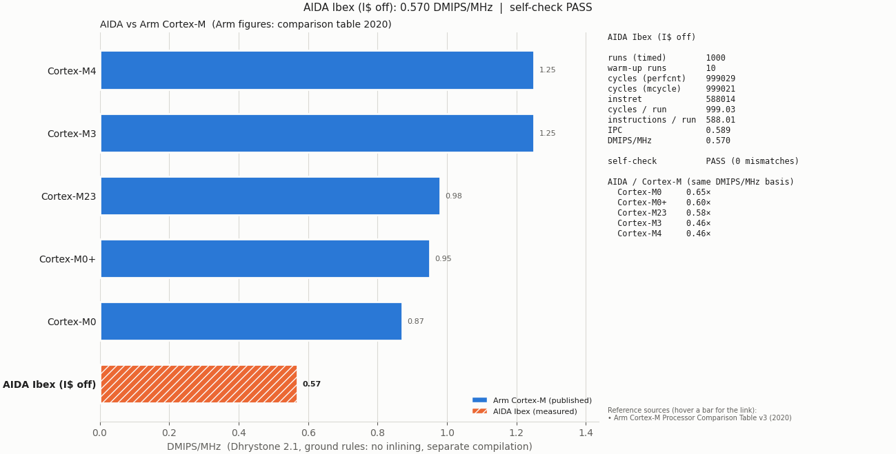

# Dhrystone 2.1 for AIDA (`aida_tb`)

Dhrystone 2.1 (Weicker, 1988) ported to the ISOLDE AIDA cluster and measured on the
`aida_tb` Verilator testbench. It follows the reference ground rules:

| Rule | How this port meets it |
| --- | --- |
| Separate compilation of Pack_1 / Pack_2 | `dhry_1.c` (main, Proc_1–5) and `dhry_2.c` (Proc_6–8, Func_1–3) are compiled to separate objects by the BSP Makefile. Keep `ENABLE_LTO=0`. |
| No procedure merging | All `Proc_x` / `Func_x` are `noinline`, so `main` really calls them (check below). |
| Loop statements unchanged | The measurement loop and all procedures are the reference 2.1 code; `Proc_6` is included. |
| Library string functions | `strcpy` / `strcmp` come from the toolchain newlib (`-lc`); `-ffreestanding` stops the compiler from expanding them inline. |
| Results verified | All final values are checked; `main` returns the number of mismatches, so the testbench prints `errors=00000000` only for a correct run. |

The only changes outside the loop:

- The two records are static objects instead of `malloc()`'d (there is no heap). Both live in data RAM.
- An untimed warm-up pass of `DHRY_WARMUP_RUNS` iterations runs before the timed pass. That's why `Arr_2_Glob[8][7]` is expected to be `DHRY_RUNS + DHRY_WARMUP_RUNS + 10`.
- Timing is in clock cycles from `aida_perfcnt` (MMIO `0x8000000C`), cross-checked with Ibex `mcycle`, plus `minstret` for IPC.

## Build and run

```sh
cd isolde/system
. ./eth.sh
make -f Makefile.nodbg patch            # once, after the Bender checkout
make -f Makefile.nodbg veri-clean verilate   # once per RTL configuration

make TEST=dhrystone21 TEST_CFLAGS=-DDHRY_RUNS=100 test-clean test-build # faster simulation
# make  TEST=dhrystone21 test-clean test-build  #default 1000 runs
make -f Makefile.nodbg TEST=dhrystone21 veri-run
# equivalent: make -f Makefile.nodbg TEST=dhrystone21 test-clean test-build veri-run
```


### Options

Pass these with `TEST_CPPFLAGS` (rebuild with `test-clean test-build`):

| Define | Default | Meaning |
| --- | --- | --- |
| `DHRY_RUNS` | 1000 | Timed iterations |
| `DHRY_WARMUP_RUNS` | 10 | Untimed warm-up iterations |
| `DHRY_ICACHE` | 0 | 1 = enable the Ibex I-cache (`cpuctrlsts[0]`) before warm-up |
| `REG` | (empty) | `-DREG=register` for the "with register" variant |

```sh
make -f Makefile.dhrystone.nodbg TEST_CPPFLAGS="-DDHRY_ICACHE=1 -DDHRY_RUNS=2000" \
     test-clean test-build veri-run
```
#### FPGA:
in folder `isolde/system`:  
```sh
. ./eth.sh 
make -C ../sw/dhrystone21 uart-plot
```

## Output

```
Measured with aida_perfcnt (id 0xd21)
  Cycles (perfcnt):                 999029
  Cycles (mcycle):                  999021
  Instructions (minstret):          588014
  Cycles per run:                   999.029
  Instructions per run:             588.014
  IPC:                              0.588
  Dhrystones per second per MHz:    1000.971
  DMIPS/MHz (1757 Dhrystones/s):    0.570
DHRYSTONE_RESULT runs=1000 cycles=999029 instret=588014 dmips_per_mhz_x1000=570
Self-check: PASS (0 mismatches)
```

`DMIPS/MHz = 10^6 / (1757 × cycles per run)`. The `DHRYSTONE_RESULT` line is meant for scripts.
`aida_perfcnt` also writes the run (id `3361` = `0xD21`) to `log/aida_tb/<lat>/waves-<n>/dhrystone21.csv`,
including the instruction, data and stack memory traffic.

Reference result: `tmp/cluster`, `demo_3` platform, `IMEM_LATENCY=0`, ISOLDE LLVM 19 (`-O3`, rv32im_zicsr),
Verilator 5.048. 999.0 cycles/run, 588.0 instructions/run, **0.570 DMIPS/MHz**. Enabling the I-cache
cuts instruction-memory reads from 918k to 104k but doesn't change the cycle count, because
the instruction memory is already single-cycle at `IMEM_LATENCY=0`.

When you quote a number, give the compiler, flags, `IMEM_LATENCY`, I-cache state and Ibex configuration with it.

## Checking that procedures were not merged

```sh
llvm-objdump -d sw/bin/dhrystone21.elf | awk '/<main>:/,/^$/' | grep -E 'jal.*<(Proc|Func)_'
```

`main` should call `Proc_1, Proc_2, Proc_4, Proc_5, Proc_6, Proc_7, Proc_8, Func_1, Func_2` once each.
(`Proc_3` is called from `Proc_1`, and `Func_3` from `Proc_6`.)


# References

Arm Cortex-M figures are Dhrystone 2.1 "ground rules" results (no inlining, no multi-file compilation), the same rules `dhrystone21` follows.

| Core | DMIPS/MHz | Source |
|---|---:|---|
| Cortex-M0 | 0.87 | [1], [5] |
| Cortex-M0+ | 0.95 | [1] |
| Cortex-M23 | 0.98 | [1] |
| Cortex-M3 | 1.25 | [1], [3] |
| Cortex-M4 | 1.25 | [1] |
| Cortex-M33 | 1.50 | [1] |
| Cortex-M55 | 1.60 | [1] |
| Cortex-M7 | 2.14 | [1] |
| Cortex-M85 | 3.13 | [4] |
| **AIDA Ibex (measured)** | **0.570** | `dhrystone21`, aida_tb / ZCU104 |

1. Arm, *Arm Cortex-M Processor Comparison Table v3* (2020). [PDF](https://developer.arm.com/-/media/Arm%20Developer%20Community/PDF/Cortex-A%20R%20M%20datasheets/Arm%20Cortex-M%20Comparison%20Table_v3.pdf)
2. Arm, *Arm Cortex-M Processor Comparison Table* (2022). Slightly higher values; build conditions not stated (`--arm-table 2022`). [PDF](https://documentation-service.arm.com/static/61bb37962183326f2176f8cc)
3. Arm, *Application Note 273: Dhrystone Benchmarking for ARM Cortex Processors*, ARM DAI 0273A (2011). Defines Arm's ground rules (`--no_inline --no_multifile`) and gives 1.25 DMIPS/MHz for Cortex-M3. [PDF](https://documentation-service.arm.com/static/6331d18bda191e7fe057c931)
4. CNX Software, *Arm Cortex-M85 is faster than Cortex-M7, offers higher ML performance than Cortex-M55* (2022-04-27). Gives 3.13 / 4.52 / 8.76 DMIPS/MHz (ground rules / inlining / multi-file). [Link](https://www.cnx-software.com/2022/04/27/arm-cortex-m85-is-faster-than-cortex-m7-offers-higher-ml-performance-than-cortex-m55/)
5. Arm, *Arm Cortex-M0 Processor Datasheet*. Gives 0.87 DMIPS/MHz. [PDF](https://www.arm.com/-/media/Arm%20Developer%20Community/PDF/Processor%20Datasheets/Arm_Cortex-M0_Processor_Datasheet.pdf)

DMIPS/MHz = 10⁶ / (1757 × cycles per run), where 1757 Dhrystones/s is the VAX 11/780 = 1 DMIPS reference.