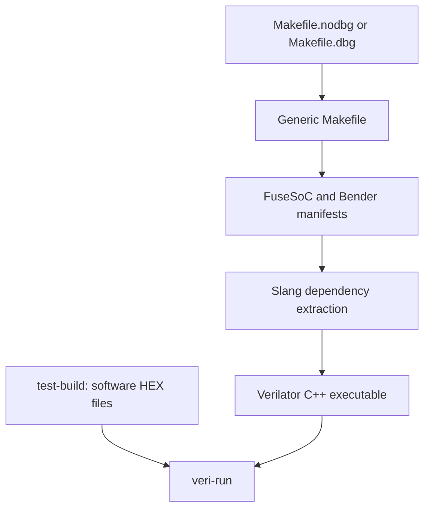

# ISOLDE Verilator Build and Run Guide

This guide describes the Verilator flow under `isolde/system`, based on the `tmp/cluster` branch and these entry points:

- [`Makefile`](https://github.com/ISOLDE-Project/ibex/blob/tmp/cluster/isolde/system/Makefile): generic implementation
- [`Makefile.nodbg`](https://github.com/ISOLDE-Project/ibex/blob/tmp/cluster/isolde/system/Makefile.nodbg): AIDA/cluster preset without the RISC-V Debug Module
- [`Makefile.dbg`](https://github.com/ISOLDE-Project/ibex/blob/tmp/cluster/isolde/system/Makefile.dbg): AIDA/cluster preset with the RISC-V Debug Module

Last verified against `tmp/cluster` commit [`f85000b`](https://github.com/ISOLDE-Project/ibex/commit/f85000b7cac675dcd13c98013bf9965a9e86b0bf), “verilator vcd trace must be explicitly enabled.”

The commands below must be run from `isolde/system` unless stated otherwise.

## 1. Build-flow overview



`Makefile.nodbg` and `Makefile.dbg` do not implement separate build systems. They set configuration variables and delegate each requested target to the generic `Makefile`.

## 2. Prerequisites and environment

From the repository root:

```sh
git submodule update --init --recursive
cd isolde/system
. ./eth.sh
```

Sourcing `eth.sh` configures the project-local tools, including:

- Bender: `eda/bender/bin/bender`
- Slang and Yosys: `eda/oss-cad-suite/bin`
- Verilator: `eda/verilator/bin/verilator`
- OpenOCD: `eda/oss-cad-suite/bin/openocd`
- Conda environment: `ibex`

The root `eth.sh` currently contains installation-specific paths for Miniconda and Vivado. Adjust those paths if the repository is installed under a different user environment.

Verify the essential tools:

```sh
"$VERILATOR" --version
"$BENDER" --version
"$SLANG" --version
```

The software build expects one of these toolchains:

```text
install/riscv-llvm   # default
install/riscv-gcc    # selected with COMPILER=gcc
```

## 3. Choosing a build mode

| Entry point | Debug module | SPM | Top module | Default test | Additional Bender selection |
| --- | ---: | ---: | --- | --- | --- |
| `Makefile` | `DBG_MODULE=0` | `ENABLE_SPM=0` | `tb_lca_system` | `dhrystone` | `-t aida_mmio` |
| `Makefile.nodbg` | disabled | enabled | `aida_tb` | `redmule128b_test` | `-t fpga_sim -D REDMULE_CLUSTER` |
| `Makefile.dbg` | enabled | enabled | `aida_tb` | `omp_test` | `-t fpga_sim -D REDMULE_CLUSTER` |

The specialized wrappers are normally preferable for the AIDA cluster. Use the generic Makefile directly when developing a new configuration or overriding several parameters.

### Trace selection

The Makefiles implement the variable `WAVES` (plural). It controls VCD waveform generation and is independent of the selected debug-module mode. The textual RTL instruction trace, `trace_core_00000000.log`, is separate from VCD generation and may still be produced when `WAVES=0`.

| Entry point | `WAVES=0` (default) | `WAVES=1` | Command line |
| --- | --- | --- | --- |
| `Makefile` | VCD support is omitted from the Verilated model; no VCD file is written. The textual RTL trace is unaffected. | Adds `--trace-vcd` and `-DVCD_TRACE`; `veri-run` writes the test VCD. The textual RTL trace is unaffected. | `make WAVES=<0\|1> veri-clean verilate` |
| `Makefile.nodbg` | RV Debug Module disabled; VCD disabled. The textual RTL trace remains available when emitted by the RTL. | RV Debug Module disabled; VCD enabled. | `make -f Makefile.nodbg WAVES=<0\|1> veri-clean verilate` |
| `Makefile.dbg` | RV Debug Module enabled; VCD disabled. Remote-bitbang debug and the textual RTL trace remain available. | RV Debug Module and VCD enabled; remote-bitbang debug remains available. | `make -f Makefile.dbg WAVES=<0\|1> veri-clean verilate` |

The command in the last column builds the selected simulator. To run a test and collect the enabled trace outputs, use the same entry point and `WAVES` value with `test-build veri-run`. For example:

```sh
make -f Makefile.nodbg WAVES=1 TEST=redmule128b_test \
  test-build veri-run
```

`WAVES=0` and `WAVES=1` use separate object, executable, and log directories. Always use the same value for `verilate` and `veri-run` so Make selects the matching executable.

## 4. Generic build

The generic entry point is the default `Makefile`:

```sh
make veri-clean verilate
```

This builds its default configuration: `tb_lca_system`, no SPM, and no RISC-V Debug Module.

To reproduce the no-debug cluster preset explicitly through the generic Makefile:

```sh
make \
  DBG_MODULE=0 \
  ENABLE_SPM=1 \
  VLT_TOP_MODULE=aida_tb \
  BENDER_EXTRA_TARGET="-t fpga_sim -D REDMULE_CLUSTER" \
  TEST=redmule128b_test \
  veri-clean verilate
```

To reproduce the debug cluster preset:

```sh
make \
  DBG_MODULE=1 \
  ENABLE_SPM=1 \
  VLT_TOP_MODULE=aida_tb \
  BENDER_EXTRA_TARGET="-t fpga_sim -D REDMULE_CLUSTER" \
  TEST=omp_test \
  veri-clean verilate
```

## 5. Cluster build without the RISC-V Debug Module

Build the simulator:

```sh
make -f Makefile.nodbg veri-clean verilate
```

Build the default software test and run it:

```sh
make -f Makefile.nodbg golden test-clean test-build veri-run
```

For another test under `isolde/sw/<test-name>`:

```sh
make -f Makefile.nodbg \
  TEST=hello_test \
  test-clean test-build veri-run
```

The simulator is configuration-dependent but not test-dependent. After building it once, different software tests can normally be compiled and run without repeating `verilate`:

```sh
make -f Makefile.nodbg TEST=test_a test-clean test-build veri-run
make -f Makefile.nodbg TEST=test_b test-clean test-build veri-run
```

Re-run `verilate` after changing RTL, source-selection targets, the top module, `IMEM_LATENCY`, `DBG_MODULE`, `ENABLE_SPM`, or waveform compilation support.

## 6. Cluster build with the RISC-V Debug Module

`Makefile.dbg` changes both the hardware and software configurations:

- Adds the Bender targets `tb_dm` and `rv_debug`.
- Selects the `tb_dm` entry from `Verilator.yml`.
- Adds the remote-bitbang and simulation-JTAG sources.
- Compiles the software with `-DRV_DM_TEST`.

### Terminal 1: build and start the simulation

```sh
cd isolde/system
. ./eth.sh

make -f Makefile.dbg veri-clean verilate
make -f Makefile.dbg golden test-clean test-build veri-run
```

Keep the simulation running. The C++ harness prints its PID and can be stopped gracefully with `Ctrl+C` or from another terminal with:

```sh
kill -INT <simulation-pid>
```

### Terminal 2: start OpenOCD

```sh
cd isolde/system
. ./openocd_sim.sh
```

The simulation configuration uses the remote-bitbang adapter on `localhost:9999`.

For a physical FPGA connection instead of Verilator:

```sh
./openocd.sh
```

### Terminal 3: control OpenOCD

```sh
telnet localhost 4444
```

Example commands:

```text
halt
reg pc 0x100080
resume
shutdown
```

Project scripts can also be sourced from the OpenOCD console:

```text
source ./read_test.tcl
source ./imem_test.tcl
```

The current debug configuration deliberately uses no OpenOCD work area. Use `progbuf` for DMEM/stack access and `sysbus` for IMEM access.

## 7. Software build

Select LLVM, which is the default:

```sh
make -f Makefile.nodbg TEST=dhrystone test-clean test-build
```

Select GCC:

```sh
make -f Makefile.nodbg \
  COMPILER=gcc \
  TEST=dhrystone \
  test-clean test-build
```

`test-build` produces the ELF and then splits its Verilog HEX image into the instruction and data inputs expected by `veri-run`:

```text
sw/bin/<TEST>.elf
sw/bin/<TEST>.hex
sw/bin/<TEST>-m.hex   # instruction memory
sw/bin/<TEST>-d.hex   # data memory
sw/bin/<TEST>.objdump
sw/bin/<TEST>.readelf
```

`veri-run` stops before simulation if either `-m.hex` or `-d.hex` is missing.

The `golden` target is relevant to RedMulE, OpenMP, and GEMM-like tests. For unrelated tests it prints that golden-data generation was skipped.

## 8. What `verilate` does

Running `verilate` automatically performs the hardware-source preparation needed by the final C++ build:

1. FuseSoC generates the Ibex simulation manifest.
2. Bender generates the ISOLDE/RedMulE manifest for the selected targets.
3. `flist2slang.py` separates source files and tool options.
4. Slang elaborates the selected top and emits a trimmed, topologically sorted `<top>_all_deps.f`.
5. `verilator_manifest.py` selects the C/C++ harness from `Verilator.yml`.
6. Verilator generates C++ under `sim/core/<top>_<latency>_waves_<WAVES>_cobj_dir`.
7. The generated C++ is compiled into `verilator_executable`.

For `aida_tb` with `IMEM_LATENCY=0`, the two generated object directories are:

```text
sim/core/aida_tb_0_waves_0_cobj_dir
sim/core/aida_tb_0_waves_1_cobj_dir
```

The corresponding executables are installed under:

```text
bin/aida_tb/0/waves-0/verilator_executable
bin/aida_tb/0/waves-1/verilator_executable
```

## 9. Waveform control

Waveform support is disabled by default. Select it explicitly when building and running:

```sh
# Build and run without VCD support; recommended for normal regression
make -f Makefile.nodbg WAVES=0 veri-clean verilate
make -f Makefile.nodbg WAVES=0 test-build veri-run

# Build and run with VCD support
make -f Makefile.nodbg WAVES=1 veri-clean verilate
make -f Makefile.nodbg WAVES=1 test-build veri-run
```

Use the same `WAVES` value for `verilate` and `veri-run`. When `WAVES=1`, the Verilator command should visibly contain both:

```text
--trace-vcd
-DVCD_TRACE
```

The resulting file is moved to:

```text
log/<top>/<IMEM_LATENCY>/waves-1/<TEST>.vcd
```

The two modes use distinct build directories. The C++ harness compiles its VCD objects and calls only when `VCD_TRACE` is defined. A configuration-specific `VLT_BUILD_TAG` is also added to the C++ flags so compiler-cache entries differ by top module, latency, and trace mode.

Both modes may coexist, but `veri-clean` is still recommended before a full RTL rebuild. Note that `veri-clean` cleans the selected binary/object configuration while removing all log directories for the selected top module.

## 10. Logs and results

For the usual `aida_tb`, `IMEM_LATENCY=0` configuration:

| Output | Location |
| --- | --- |
| Verilator build log | `log/aida_tb/0/waves-<WAVES>/verilate.log` |
| Filtered build warnings | `log/aida_tb/0/waves-<WAVES>/verilate_warnings.log` |
| Simulation console log | `log/aida_tb/0/waves-<WAVES>/<TEST>.log` when `NO_TEE=0` |
| RTL instruction trace | `log/aida_tb/0/waves-<WAVES>/trace_core_00000000.log` when emitted |
| VCD waveform | `log/aida_tb/0/waves-1/<TEST>.vcd` when `WAVES=1` |
| Performance counters | `log/aida_tb/0/waves-<WAVES>/<TEST>.csv` when emitted |

The default is `NO_TEE=1`, so simulation output is printed to the terminal but is not copied to `<TEST>.log`. Enable logging with:

```sh
make -f Makefile.nodbg TEST=<test-name> NO_TEE=0 veri-run
```

A normal testbench success marker is:

```text
[FPGA SIM] @ t=<time> - errors=00000000
```

## 11. Frequently used variables

| Variable | Default in generic flow | Meaning |
| --- | --- | --- |
| `TEST` | `dhrystone` | Software-test directory and output basename |
| `COMPILER` | LLVM when unset | Set to `gcc` for the GCC toolchain |
| `VLT_TOP_MODULE` | `tb_lca_system` | Verilator/SystemVerilog top module |
| `IMEM_LATENCY` | `0` | Top-level parameter and output-directory selector |
| `DBG_MODULE` | `0` | Include the RISC-V Debug Module and debug harness |
| `ENABLE_SPM` | `0` | Add the `spm` Bender target |
| `BENDER_EXTRA_TARGET` | `-t aida_mmio` | Additional Bender source selection |
| `WAVES` | `0` | Compile and emit VCD tracing when set to `1` |
| `NO_TEE` | `1` | Set to `0` to save simulation console output |
| `VERI_FLAGS` | empty | Additional runtime arguments for the simulator |
| `FUSESOC_PARAMS` | empty | Additional FuseSoC parameters |
| `FUSESOC_CONFIG_OPTS` | empty | Additional FuseSoC configuration options |

Command-line assignments override defaults:

```sh
make -f Makefile.nodbg \
  TEST=spm_test \
  IMEM_LATENCY=1 \
  WAVES=1 \
  NO_TEE=0 \
  veri-clean verilate test-build veri-run
```

## 12. Cleaning

Clean the Verilator configuration and generated FuseSoC files:

```sh
make -f Makefile.nodbg WAVES=0 veri-clean
```

Use `WAVES=1` instead to remove the traced object and executable configuration. The outer target also removes all logs belonging to the selected top module.

If generated PCH files remain corrupted, a hard clean is available:

```sh
make -f Makefile.nodbg WAVES=0 veri-hard-clean
```

`veri-hard-clean` removes every `*_cobj_dir` below `isolde/system/sim/core` and executes `ccache -C`. The latter clears the entire compiler cache for the current user, including entries unrelated to this repository. Use it only when a normal `veri-clean` is insufficient.

Clean the selected software test:

```sh
make -f Makefile.nodbg TEST=<test-name> test-clean
```

Perform the broader combined clean defined by the generic Makefile:

```sh
make clean
```

Use the same wrapper and configuration variables for cleaning that were used for building. This ensures the computed top module, latency, executable directory, and object directory match the files being removed.

## 13. Troubleshooting

### Clang reports a malformed or corrupted AST/PCH file

Typical message:

```text
malformed or corrupted AST file: could not find file ... referenced by AST file ...gch
```

Compare the active `--Mdir` with the directory embedded in the error. If they differ, an object cache has restored a path-dependent precompiled header from another Verilator object directory.

The current build gives each trace mode a distinct object directory and adds `VLT_BUILD_TAG` to its C++ flags. First clean and rebuild the affected configuration:

```sh
make -f Makefile.nodbg \
  WAVES=1 \
  veri-clean verilate
```

If a previously poisoned cache entry is still restored, use `veri-hard-clean` once and rebuild. Be aware that it runs `ccache -C` and therefore clears the current user's entire compiler cache, not just ISOLDE entries.

### `WAVES=1` produces no VCD

Inspect the printed Verilator command. It must contain `--trace-vcd`, and its `-CFLAGS` string must contain `-DVCD_TRACE`. If both are absent, verify that the new revision is checked out and that `WAVES=1` appears before the requested targets. The generic Makefile validates the value, and the Verilator wrapper forwards it to the inner build.

### `veri-run` reports missing `-m.hex` or `-d.hex`

Build the selected software first, using exactly the same `TEST` value:

```sh
make -f Makefile.nodbg TEST=<test-name> test-clean test-build
```

### OpenOCD cannot connect to remote bitbang

Confirm all of the following:

1. The simulator was built with `Makefile.dbg` or `DBG_MODULE=1`.
2. `veri-run` is still running.
3. The simulation is listening on `localhost:9999`.
4. `openocd_sim.sh` uses `isolde.cfg`.

### Hardware source lists appear stale

Regenerate from a clean state:

```sh
make -f Makefile.nodbg veri-clean
make -f Makefile.nodbg verilate
```

`verilate` regenerates the FuseSoC, Bender, Slang, and Verilator manifests through its prerequisites.

## 14. Recommended command sequences

### Fast no-debug development loop

```sh
cd isolde/system
. ./eth.sh

make -f Makefile.nodbg WAVES=0 veri-clean verilate
make -f Makefile.nodbg TEST=redmule128b_test golden test-clean test-build veri-run
```

### No-debug run with waveform capture

```sh
make -f Makefile.nodbg WAVES=1 veri-clean verilate
make -f Makefile.nodbg WAVES=1 TEST=redmule128b_test \
  golden test-clean test-build veri-run
```

### Debug-module session

Terminal 1:

```sh
cd isolde/system
. ./eth.sh
make -f Makefile.dbg WAVES=0 veri-clean verilate
make -f Makefile.dbg WAVES=0 TEST=omp_test \
  golden test-clean test-build veri-run
```

Terminal 2:

```sh
cd isolde/system
. ./openocd_sim.sh
```

Terminal 3:

```sh
telnet localhost 4444
```

### Run the existing no-debug regression

Build the required simulator configuration first, then run:

```sh
bash ./regression_nodbg.sh
```

Regression logs are stored under `regression-logs/<UTC timestamp>-<pid>/`. Each configuration passes only when Make succeeds, the complete log is saved, and the expected zero-error FPGA-simulation marker is present.
